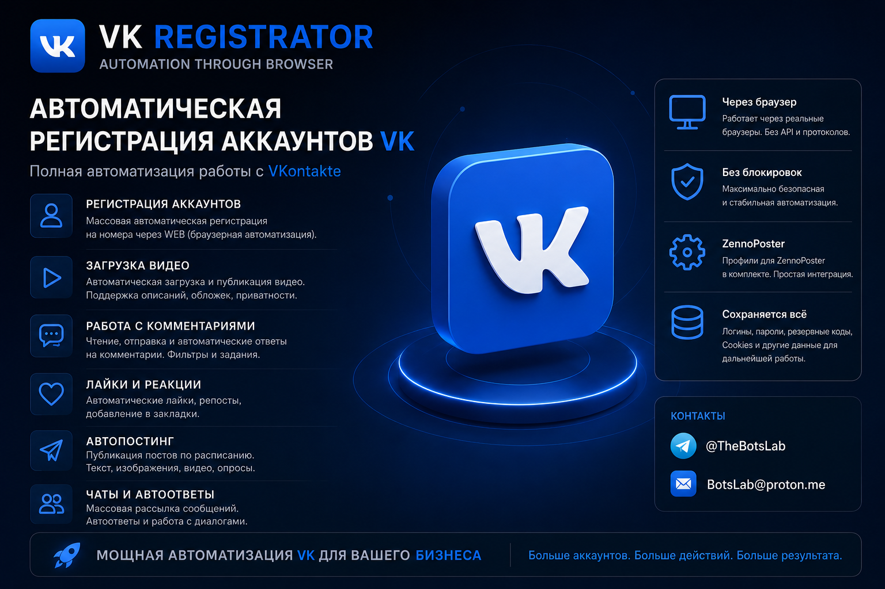

# VK Account Registrator — browser workflow automation

  

  <strong>Автоматизация разрешённых браузерных рабочих процессов для управления собственными VK-аккаунтами.</strong>

  <a href="docs/README.en.md">English</a> ·
  <a href="docs/README.uk.md">Українська</a> ·
  <a href="docs/README.zh-CN.md">中文</a> ·
  <a href="docs/README.he.md">עברית</a>

## О продукте

**VK Account Registrator** — коммерческое решение для автоматизации разрешённых браузерных операций с аккаунтами VK, которыми владеет или имеет право администрировать пользователь. Продукт ориентирован на управляемые рабочие процессы, где требуется централизованно сохранять служебные данные, профили автоматизации и историю операций.

Работает через браузерную автоматизацию. Это **не официальный продукт VK** и не является заявлением о партнёрстве, одобрении или интеграции со стороны VK.

## Возможности

- Браузерный workflow для операций с собственными аккаунтами.
- Организация и сохранение служебных данных аккаунта в контролируемой среде.
- Поддержка профилей ZennoPoster для разрешённых сценариев автоматизации.
- Подготовка рабочих процессов для публикаций, обработки комментариев, загрузки контента и коммуникаций — в пределах правил платформы и применимого законодательства.
- Возможность адаптации под согласованный бизнес-процесс.

## Что важно

- Использование допускается только для аккаунтов и данных, на которые у пользователя есть законные права.
- Пользователь отвечает за соблюдение правил VK, лимитов платформы, требований к персональным данным и законодательства своей юрисдикции.
- Решение не обещает обход защит, антифрода, ограничений или блокировок платформы.
- В этом публичном репозитории **нет** рабочих учётных данных, cookies, резервных кодов, номеров телефонов, клиентской базы или внутреннего исходного кода.

## Лицензирование и поддержка

- **Open Source + доработки:** от **$314**.
- **Поддержка и обновления:** от **$50 / месяц**.

Точный состав поставки, лицензия, совместимость и допустимый сценарий использования согласуются до покупки.

## Контакты

- Telegram: [@TheBotsLab](https://t.me/TheBotsLab)
- E-mail: [BotsLab@proton.me](mailto:BotsLab@proton.me)

## Источник и статус

Исходное объявление: [ZennoClub — «Автоматический регистратор VK»](https://zenno.club/discussion/threads/avtomaticheskii-registrator-vk.133551/).

Иллюстрация в `assets/` взята из материала оффера. Названия и знаки VK, Telegram и ZennoPoster принадлежат соответствующим правообладателям; их упоминание носит исключительно идентификационный характер.

## Public-safety boundary

Этот репозиторий — публичная продуктовая документация. Он не предназначен для массового создания аккаунтов, спама, накрутки, обхода ограничений, несанкционированного доступа или нарушения правил сторонних платформ.
